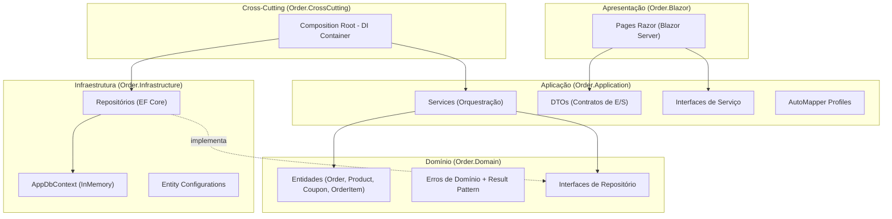
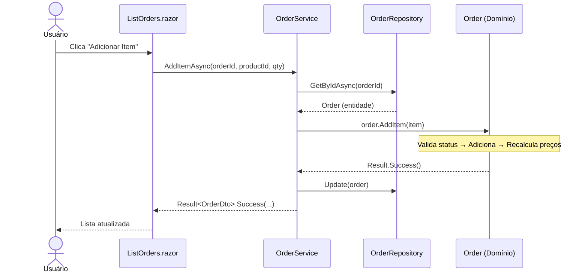

# Sistema de Gerenciamento de Pedidos — Clean Architecture

> Projeto de estudo e demonstração prática da **Clean Architecture** aplicada a um sistema de gerenciamento de pedidos com **Produtos**, **Cupons de Desconto** e **Pedidos**, construído com **.NET 8** e **Blazor Server**.

---

## Índice

- [Sobre o Projeto](#sobre-o-projeto)
- [O que é Clean Architecture?](#o-que-é-clean-architecture)
- [Visão Geral da Arquitetura](#visão-geral-da-arquitetura)
- [Estrutura da Solução](#estrutura-da-solução)
- [As Camadas e suas Responsabilidades](#as-camadas-e-suas-responsabilidades)
- [Fluxo de um Pedido](#fluxo-de-um-pedido)
- [Padrões e Práticas Utilizados](#padrões-e-práticas-utilizados)
- [Quando Usar Clean Architecture](#quando-usar-clean-architecture)
- [Quando NÃO Usar (Trade-offs)](#quando-não-usar-trade-offs)
- [Vantagens e Desvantagens](#vantagens-e-desvantagens)
- [Conclusão](#conclusão)

---

## Sobre o Projeto

Esta aplicação permite gerenciar um fluxo completo de pedidos: cadastrar produtos, criar cupons de desconto, montar pedidos com itens, aplicar cupons e controlar o ciclo de vida (abrir, fechar, cancelar).

O objetivo principal **não é o produto em si**, mas demonstrar como a **Clean Architecture** separa as regras de negócio (domínio) da infraestrutura, da interface gráfica e dos detalhes de implementação — tornando o núcleo da aplicação **testável, independente e protegido de mudanças externas**.

> **Nota:** O banco de dados é **InMemory** (EF Core), ideal para demonstrar a arquitetura sem dependências externas. Trocar para SQL Server, PostgreSQL ou qualquer outro provider exige alterar **apenas a configuração do DbContext** na camada de infraestrutura — sem tocar no domínio ou na aplicação.

---

## O que é Clean Architecture?

A **Clean Architecture** foi sistematizada por **Robert C. Martin (Uncle Bob)** em 2012. A ideia central:

> *"As regras de negócio são a parte mais importante de um sistema. A arquitetura deve protegê-las de mudanças nas ferramentas, frameworks e mecanismos de entrega."*

Em vez de organizar o código por funcionalidade técnica (controllers, models, views), organizamos em **círculos concêntricos** onde a **regra de dependência** é absoluta:

> **As dependências sempre apontam para dentro — do externo para o interno, nunca o contrário.**

```
┌─────────────────────────────────────────────────────────────┐
│  Frameworks & Drivers (Blazor, EF Core, DI Container)       │
│  ┌───────────────────────────────────────────────────────┐  │
│  │  Interface Adapters (Services, DTOs, Mappings)         │  │
│  │  ┌─────────────────────────────────────────────────┐  │  │
│  │  │  Application (Casos de Uso / Orquestração)       │  │  │
│  │  │  ┌───────────────────────────────────────────┐  │  │  │
│  │  │  │  Domain (Entidades + Regras de Negócio)    │  │  │  │
│  │  │  └───────────────────────────────────────────┘  │  │  │
│  │  └─────────────────────────────────────────────────┘  │  │
│  └───────────────────────────────────────────────────────┘  │
└─────────────────────────────────────────────────────────────┘
```

O **Domain** não conhece nada do mundo externo. Ele define interfaces (contratos) que as camadas externas implementam — isso é a **Inversão de Dependência** (o "D" do SOLID).

---

## Visão Geral da Arquitetura



> **Fluxo de dependência:** Blazor → Application → Domain ← Infrastructure. A infraestrutura depende do domínio (implementa suas interfaces), nunca o contrário.

---

## Estrutura da Solução

```
Clean Architecture/
│
├── Order.Domain/                     NÚCLEO — não depende de ninguém
│   ├── Entities/
│   │   ├── Base/
│   │   │   └── Entity.cs             → Classe base com Id (Guid)
│   │   ├── Order.cs                  → Aggregate Root: pedido com regras de negócio
│   │   ├── OrderItem.cs              → Entidade filha do pedido
│   │   └── Product.cs                → Entidade com Factory Method e validação
│   ├── Coupon.cs                     → Entidade com ciclo de vida (ativar/inativar)
│   ├── Enums/
│   │   └── Status.cs                 → Open, Finished, Canceled
│   ├── Errors/
│   │   ├── Error.cs                  → Record imutável (Code, Message)
│   │   ├── OrderErrors.cs            → Erros específicos de pedidos
│   │   ├── ProductErrors.cs          → Erros específicos de produtos
│   │   └── CouponErrors.cs           → Erros específicos de cupons
│   ├── Returns/
│   │   └── Result.cs                 → Result Pattern (Success/Failure sem exceções)
│   └── Interfaces/
│       └── Repositories/
│           ├── IOrderRepository.cs   → Contrato de persistência de pedidos
│           ├── IProductRepository.cs → Contrato de persistência de produtos
│           └── ICouponRepository.cs  → Contrato de persistência de cupons
│
├── Order.Application/                CASOS DE USO — depende só do Domain
│   ├── Interfaces/
│   │   ├── IOrderService.cs          → Contrato dos casos de uso de pedidos
│   │   ├── IProductService.cs        → Contrato dos casos de uso de produtos
│   │   └── ICouponService.cs         → Contrato dos casos de uso de cupons
│   ├── Services/
│   │   ├── OrderService.cs           → Orquestra regras do domínio (não contém lógica)
│   │   ├── ProductService.cs         → Orquestra criação/atualização de produtos
│   │   └── CouponService.cs          → Orquestra CRUD + ativar/inativar cupons
│   ├── DTOs/
│   │   ├── Order/                    → CreateOrderDto, UpdateOrderDto, OrderDto
│   │   ├── Product/                  → CreateProductDto, UpdateProductDto, ProductDto
│   │   └── Coupon/                   → CreateCouponDto, UpdateCouponDto, CouponDto
│   └── Mappings/
│       ├── OrderMappingProfile.cs    → Entidade → DTO (AutoMapper)
│       ├── ProductMappingProfile.cs
│       └── CouponMappingProfile.cs
│
├── Order.Infrastructure/             IMPLEMENTAÇÃO — depende do Domain
│   ├── Context/
│   │   ├── AppDbContext.cs           → EF Core DbContext (InMemory)
│   │   └── DatabaseSeeder.cs         → Dados iniciais para desenvolvimento
│   ├── EntityConfigurations/
│   │   └── ProductConfiguration.cs   → Configuração fluent do EF Core
│   └── Repositories/
│       ├── OrderRepository.cs        → Implementa IOrderRepository
│       ├── ProductRepository.cs      → Implementa IProductRepository
│       └── CouponRepository.cs       → Implementa ICouponRepository
│
├── Order.CrossCutting/               COMPOSITION ROOT — liga tudo via DI
│   └── IoC/
│       └── DependencyInjection.cs    → Registra serviços, repositórios e AutoMapper
│
└── Order.Blazor/                     APRESENTAÇÃO — Blazor Server (.NET 8)
    ├── Components/
    │   ├── Layout/
    │   │   └── MainLayout.razor      → Navbar com navegação
    │   └── Pages/
    │       ├── Home.razor            → Dashboard com acesso rápido
    │       ├── Products.razor        → CRUD de produtos
    │       ├── Coupons.razor         → CRUD + ativar/inativar cupons
    │       ├── Orders.razor          → Listagem e criação de pedidos
    │       └── ListOrders.razor      → Gerenciar itens + aplicar cupom
    └── Program.cs                    → Startup + Seed de dados
```

---

## As Camadas e suas Responsabilidades

### Domain — O Coração

O domínio **não depende de nada**. Define entidades ricas com comportamento, não apenas dados.

```csharp
// Factory Method: só cria se as regras forem atendidas
public static Result<Product> Create(string name, decimal price)
{
    var error = Validate(name, price);
    if (error is not null)
        return Result<Product>.Failure(error);

    return Result<Product>.Success(new Product(Guid.NewGuid(), name.Trim(), price));
}
```

```csharp
// O pedido decide se aceita um cupom (regra de negócio no domínio)
public Result ApplyCoupon(Coupon coupon)
{
    var statusValidationResult = ValidateOrderStatus(Status);
    if (!statusValidationResult.IsSuccess)
        return statusValidationResult;

    if (Coupon != null)
        return Result.Failure(OrderErrors.CouponAlreadyApplied);

    var couponValidationResult = coupon.IsValid();
    if (!couponValidationResult.IsSuccess)
        return couponValidationResult;

    Coupon = coupon;
    RecalculatePrices();
    return Result.Success();
}
```

**Princípios aplicados:**
- Construtores `private` — objetos só nascem válidos (via Factory Method)
- Setters `private` — estado só muda por métodos de domínio
- Result Pattern — comunica falhas sem exceções
- Cada entidade valida a si mesma

### Application — Orquestração

Os serviços **não contêm regras de negócio**. Eles resolvem dependências (repositórios), delegam para o domínio e devolvem DTOs.

```csharp
// O serviço apenas orquestra — a regra está no domínio
public async Task<Result<OrderDto>> AddItemAsync(Guid orderId, Guid productId, int quantity)
{
    var order = await _repository.GetByIdAsync(orderId);
    if (order is null)
        return Result<OrderDto>.Failure(OrderErrors.NonExistent);

    var product = await _productRepository.GetByIdAsync(productId);
    if (product is null)
        return Result<OrderDto>.Failure(ProductErrors.NonExistent);

    var item = new OrderItem(product, quantity);
    var result = order.AddItem(item);  // Regra no domínio

    if (!result.IsSuccess)
        return Result<OrderDto>.Failure(result.Error!);

    _repository.Update(order);
    return Result<OrderDto>.Success(_mapper.Map<OrderDto>(order));
}
```

### Infrastructure — Detalhes Técnicos

Implementa os contratos definidos pelo domínio. Se amanhã trocar de banco, **só esta camada muda**.

### CrossCutting — Composition Root

Liga todas as pontas: registra repositórios, serviços e profiles de mapeamento no container de DI. Nenhuma camada interna depende dele.

### Blazor — Apresentação

Apenas coleta dados da UI, chama o serviço (via interface) e exibe resultados. Zero regra de negócio.

---

## Fluxo de um Pedido



---

## Padrões e Práticas Utilizados

| Padrão | Onde | Para quê |
|--------|------|----------|
| **Clean Architecture** | Toda a solução | Separar domínio de infraestrutura |
| **DDD** | Domain | Entidades ricas, Aggregate Root, Factory Methods |
| **Result Pattern** | Domain/Application | Comunicar erros sem exceções |
| **Factory Method** | `Product.Create()`, `Order.Create()`, `Coupon.Create()` | Garantir que objetos nasçam válidos |
| **Repository Pattern** | Domain (interface) + Infrastructure (impl.) | Abstrair persistência |
| **DTO Pattern** | Application | Isolar contrato externo da entidade interna |
| **Dependency Injection** | CrossCutting | Inversão de controle (SOLID - D) |
| **Composition Root** | `DependencyInjection.cs` | Único lugar que conhece todas as implementações |

---

## Quando Usar Clean Architecture

- **Domínio rico** com regras de negócio que merecem ser isoladas e testadas (ex: cálculo de preços, validação de status, aplicação de cupom).
- **Vida longa do software** — trocar banco, framework de UI ou provider externo sem reescrever regras.
- **Múltiplos pontos de entrada** — a mesma Application Layer pode servir Blazor, API REST, gRPC ou CLI.
- **Equipes que valorizam testabilidade** — o domínio pode ser testado unitariamente sem banco, sem UI, sem nada externo.
- **Separação clara de responsabilidades** entre quem codifica UI, quem codifica regras e quem codifica infraestrutura.

---

## Quando NÃO Usar (Trade-offs)

- **CRUDs simples** sem regra de negócio relevante: a cerimônia das camadas não compensa.
- **Protótipos descartáveis** ou MVPs com prazo apertado.
- **Domínio anêmico** (entidades que são só getters/setters): o isolamento não agrega valor real.
- **Aplicações muito pequenas** onde uma camada a mais significa dobrar o número de arquivos sem benefício.
- **Equipes iniciantes** sem familiaridade com DI e inversão de dependência: a curva de aprendizado pode travar o projeto.

> O custo da Clean Architecture é **mais projetos, mais interfaces e mais indireção**. Ela compensa quando a longevidade, testabilidade e flexibilidade pagam esse investimento ao longo do tempo.

---

## Vantagens e Desvantagens

| Vantagens | Desvantagens |
|-----------|--------------|
| Domínio 100% independente de tecnologia | Mais projetos e mais arquivos (boilerplate) |
| Alta testabilidade do núcleo | Curva de aprendizado (camadas, DI, abstrações) |
| Troca de infraestrutura sem tocar no domínio | Indireção dificulta "ir direto ao ponto" em problemas simples |
| Fronteiras explícitas (cada projeto tem 1 razão de existir) | Tentação de criar abstrações desnecessárias |
| Facilita trabalho paralelo em equipe | Exige disciplina para manter a regra de dependência |
| Domínio expressa a linguagem do negócio (DDD) | Para CRUDs triviais, é excesso de engenharia |

---

## Conclusão

Este projeto mostra, com um caso de uso realista e legível, como a **Clean Architecture** mantém as **regras de negócio no centro** e empurra detalhes técnicos (UI, banco, mapeamento) para as bordas. As entidades são ricas: decidem se aceitam um cupom, validam seu próprio estado, recalculam preços. Os serviços apenas orquestram. A infraestrutura apenas persiste. E a UI apenas exibe.

O resultado é um sistema onde **trocar o banco de dados** (de InMemory para PostgreSQL), **adicionar uma API REST** ou **substituir o Blazor por outro framework** não exige tocar nas regras de negócio — exatamente a promessa da Clean Architecture.
