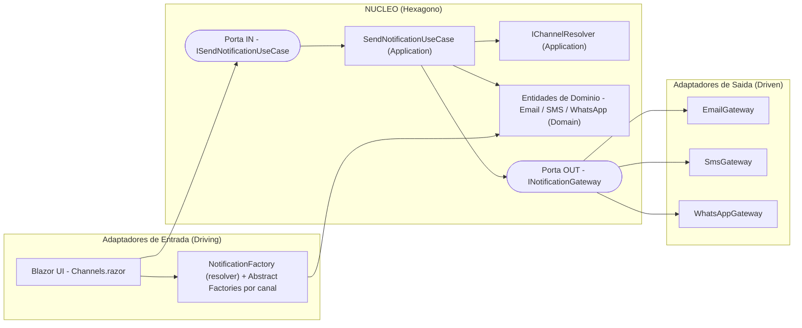
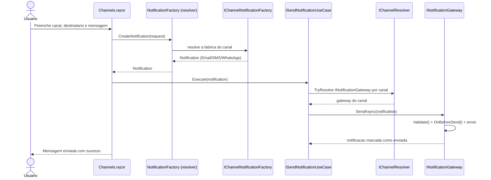

# Sistema de Notificações Multi-Canal — Arquitetura Hexagonal (Ports & Adapters)

> Projeto de estudo e demonstração prática da **Arquitetura Hexagonal** (também conhecida como **Ports & Adapters**) aplicada a um sistema de envio de notificações por múltiplos canais (**Email**, **SMS** e **WhatsApp**), construído com **.NET 8** e **Blazor Server**.

---

## Índice

- [Sobre o Projeto](#sobre-o-projeto)
- [O que é Arquitetura Hexagonal?](#o-que-é-arquitetura-hexagonal)
- [Visão Geral da Arquitetura](#visão-geral-da-arquitetura)
- [Estrutura da Solução](#estrutura-da-solução)
- [As Portas e os Adaptadores](#as-portas-e-os-adaptadores)
- [Fluxo de uma Notificação](#fluxo-de-uma-notificação)
- [Padrões de Projeto Utilizados](#padrões-de-projeto-utilizados)
- [Quando Usar Arquitetura Hexagonal](#quando-usar-arquitetura-hexagonal)
- [Quando NÃO Usar (Trade-offs)](#quando-não-usar-trade-offs)
- [Vantagens e Desvantagens](#vantagens-e-desvantagens)
- [Como Executar](#como-executar)
- [Conclusão](#conclusão)

---

## Sobre o Projeto

Esta aplicação permite enviar notificações através de diferentes canais de comunicação. O usuário seleciona um canal na interface (Blazor), digita o destinatário, o assunto e a mensagem, e o sistema roteia a notificação para o **adaptador** correto.

O objetivo principal **não é o produto em si**, mas demonstrar como a **Arquitetura Hexagonal** isola as regras de negócio das tecnologias externas (UI, provedores de email, APIs de mensageria), tornando o núcleo da aplicação **testável, independente e fácil de evoluir**.

> **Nota:** Atualmente os gateways de envio (Email, SMS e WhatsApp) estão **simulados** (apenas registram logs), o que é perfeito para demonstrar a arquitetura sem depender de credenciais ou serviços externos. Trocar uma simulação por uma implementação real exige alterar **apenas o adaptador**, sem tocar no núcleo — e é exatamente esse o ponto da Arquitetura Hexagonal.

---

## O que é Arquitetura Hexagonal?

A **Arquitetura Hexagonal** foi proposta por **Alistair Cockburn** em 2005. A ideia central é simples e poderosa:

> *"Permita que uma aplicação seja igualmente conduzida por usuários, programas, testes automatizados ou scripts, e que seja desenvolvida e testada isoladamente de seus dispositivos e bancos de dados em tempo de execução."*

Em vez de pensar em camadas horizontais empilhadas (UI -> Negócio -> Banco), pensamos em um **núcleo central** (o hexágono) cercado por **portas** e **adaptadores**:

- **Núcleo (Domínio + Aplicação):** contém as regras de negócio. **Não conhece** tecnologia externa.
- **Portas (Ports):** são **interfaces** que definem *como* o mundo externo conversa com o núcleo (e vice-versa).
- **Adaptadores (Adapters):** são **implementações concretas** das portas, que conectam o núcleo a tecnologias reais (Blazor, SMTP, APIs REST, etc.).

A regra de ouro é a **Regra de Dependência**: **as dependências sempre apontam para dentro**, em direção ao núcleo. O domínio nunca depende da infraestrutura — é a infraestrutura que depende das abstrações do domínio (Inversão de Dependência, o "D" do SOLID).

### Portas de Entrada vs Portas de Saída

| Tipo | Também chamada de | Direção | Exemplo neste projeto |
|------|-------------------|---------|------------------------|
| **Porta de Entrada** (Driving/Primary) | Lado que **conduz** a aplicação | Mundo externo -> Núcleo | `ISendNotificationUseCase` |
| **Porta de Saída** (Driven/Secondary) | Lado que **é conduzido** pela aplicação | Núcleo -> Mundo externo | `INotificationGateway` |

---

## Visão Geral da Arquitetura



> O fluxo de dependências aponta **para dentro**: os adaptadores (Blazor e gateways) dependem das **portas** do núcleo, nunca o contrário.

---

## Estrutura da Solução

```
Arquiteturas/
|
+-- Notification.Domain/            NUCLEO - nao depende de ninguem
|   +-- Abstract/
|   |   +-- Notification.cs          -> Classe base abstrata (Template Method no Validate)
|   +-- Entities/
|   |   +-- EmailNotification.cs     -> Regras e validacoes de Email
|   |   +-- SmsNotification.cs       -> Regras e validacoes de SMS
|   |   +-- WhatsAppNotification.cs  -> Regras e validacoes de WhatsApp
|   +-- ValueObjects/
|   |   +-- ChannelSpecification.cs  -> Produto da Abstract Factory (metadados do canal)
|   +-- Ports/
|       +-- IChannelComponent.cs     -> Contrato comum "tem um Channel" (base de gateways e fabricas)
|       +-- In/
|       |   +-- ISendNotificationUseCase.cs   (Porta de ENTRADA)
|       +-- Out/
|           +-- INotificationGateway.cs       (Porta de SAIDA)
|
+-- Notification.Application/        CASOS DE USO - depende so do Domain
|   +-- Common/
|   |   +-- IChannelResolver.cs      -> Resolve um componente "por canal" (generico)
|   |   +-- ChannelResolver.cs       -> Implementacao via IServiceProvider
|   +-- DTOs/
|   |   +-- CreateNotificationRequest.cs
|   +-- Factories/
|   |   +-- Interfaces/
|   |   |   +-- IChannelNotificationFactory.cs   -> Abstract Factory (contrato da familia)
|   |   |   +-- INotificationFactory.cs          -> Fachada/resolver exposto a UI
|   |   +-- EmailNotificationFactory.cs          -> Fabrica concreta do canal Email
|   |   +-- SmsNotificationFactory.cs            -> Fabrica concreta do canal SMS
|   |   +-- WhatsAppNotificationFactory.cs       -> Fabrica concreta do canal WhatsApp
|   |   +-- NotificationFactory.cs               -> Resolve a fabrica pelo canal e delega
|   +-- UseCases/
|       +-- SendNotificationUseCase.cs           -> Implementa a porta de entrada
|
+-- Notification.Infrastructure/    ADAPTADORES DE SAIDA - depende so do Domain
|   +-- Gateways/
|   |   +-- EmailGateway.cs          -> Implementa INotificationGateway
|   |   +-- SmsGateway.cs            -> Implementa INotificationGateway
|   |   +-- WhatsAppGateway.cs       -> Implementa INotificationGateway
|   +-- DependecyInjection/
|       +-- ServiceCollectionExtensions.cs
|
+-- Hexagonal/ (Notification.Blazor) ADAPTADOR DE ENTRADA + COMPOSITION ROOT
    +-- Components/Pages/
    |   +-- Channels.razor           -> Interface do usuario
    +-- Services/
    |   +-- ChannelService.cs        -> Descobre canais dinamicamente
    +-- Models/
    |   +-- ChannelModel.cs
    |   +-- MessageFormModel.cs
    +-- Program.cs                   -> Composition Root (liga tudo via DI)
```

---

## As Portas e os Adaptadores

### Porta de Entrada — `ISendNotificationUseCase`

Define **o que** a aplicação sabe fazer, sem revelar **como**. É o contrato que o mundo externo (a UI) usa para conduzir o núcleo.

```csharp
namespace Notification.Domain.Ports.In
{
    public interface ISendNotificationUseCase
    {
        Task Execute(Abstract.Notification notification);
    }
}
```

### Porta de Saída — `INotificationGateway`

Define **como** o núcleo fala com o mundo externo para entregar a notificação. Cada canal é um adaptador que implementa essa porta.

```csharp
namespace Notification.Domain.Ports.Out
{
    public interface INotificationGateway : IChannelComponent
    {
        Task SendAsync(Abstract.Notification notification);
    }
}
```

### Contrato comum — `IChannelComponent`

Tanto os gateways quanto as fábricas precisam dizer **a qual canal pertencem**. Esse contrato mínimo (`string Channel`) permite resolver a implementação correta a partir do nome do canal, de forma genérica.

```csharp
namespace Notification.Domain.Ports
{
    public interface IChannelComponent
    {
        string Channel { get; }
    }
}
```

### Adaptador de Saída (exemplo) — `EmailGateway`

```csharp
public class EmailGateway : INotificationGateway
{
    public string Channel => "Email";
    // ... valida, prepara e (atualmente) simula o envio via log
}
```

### Adaptador de Entrada — Blazor (`Channels.razor`)

A UI é apenas mais um adaptador. Ela cria a notificação via fachada de fábrica e dispara o caso de uso através da porta de entrada — sem conhecer nenhum detalhe de envio.

---

## Fluxo de uma Notificação



**Passo a passo:**

1. O usuário interage com o **adaptador de entrada** (`Channels.razor`).
2. A `NotificationFactory` (resolver) seleciona a `IChannelNotificationFactory` do canal e cria a **família de produtos**: a **entidade de domínio** (a partir do `CreateNotificationRequest`) e a `ChannelSpecification` consumida pela UI.
3. A UI invoca a **porta de entrada** (`ISendNotificationUseCase`).
4. O caso de uso usa o `IChannelResolver` para selecionar o **adaptador de saída** adequado via **porta de saída** (`INotificationGateway`).
5. O gateway executa as **regras de domínio** (`Validate`, `OnBeforeSend`) e realiza o envio.
6. A entidade atualiza seu próprio estado (`MarkAsSent` / `MarkAsFailed`).

---

## Padrões de Projeto Utilizados

| Padrão | Onde | Para quê |
|--------|------|----------|
| **Ports & Adapters** | Toda a solução | Isolar o núcleo das tecnologias externas |
| **Template Method** | `Notification.Validate()` (abstract) | Fixar a sequência de validação (ValidateRecipient -> ValidateMessage -> ValidateSubject) na classe base, deixando as subclasses preencherem os passos |
| **Abstract Factory** | `IChannelNotificationFactory` + fábricas concretas (Email/SMS/WhatsApp) | Criar uma **família de produtos** coesa por canal (a entidade `Notification` **e** a `ChannelSpecification`) sem o cliente conhecer as classes concretas |
| **Facade / Resolver** | `INotificationFactory` / `NotificationFactory` e `IChannelResolver` / `ChannelResolver` | Esconder a seleção da implementação concreta pelo nome do canal; o resolver é genérico e reaproveitado por gateways e fábricas |
| **Strategy** (implícito) | `INotificationGateway` + seleção por `Channel` | Trocar o algoritmo de envio em tempo de execução |
| **Dependency Injection** | `Program.cs` + `ServiceCollectionExtensions` | Inversão de controle e composição (Composition Root) |

### Destaque 1: Template Method em `Notification.Validate()`

A classe base define a **ordem** dos passos de validação; as subclasses fornecem os passos. O `ValidateSubject` é um **hook opcional** (corpo vazio na base) que apenas o Email sobrescreve, já que SMS e WhatsApp não usam assunto.

```csharp
public abstract class Notification
{
    // Template method: a sequencia e fixa e mora na base
    public void Validate()
    {
        ValidateRecipient();
        ValidateMessage();
        ValidateSubject();   // hook opcional
    }

    protected abstract void ValidateRecipient();  // cada canal e obrigado a implementar
    protected abstract void ValidateMessage();    // cada canal e obrigado a implementar
    protected virtual  void ValidateSubject() { } // opcional: padrao vazio, so o Email sobrescreve
}
```

### Destaque 2: Abstract Factory + Resolver genérico

Cada canal tem uma **fábrica concreta** (`IChannelNotificationFactory`) que produz uma família coesa de objetos: a entidade de notificação **e** os metadados do canal (`ChannelSpecification`). A UI nunca conhece classes concretas — ela fala apenas com a fachada `INotificationFactory`.

A escolha da fábrica certa (e do gateway certo) é centralizada no `IChannelResolver`, eliminando a duplicação do "resolver por canal" que antes existia em dois lugares:

```csharp
public TComponent? TryResolve<TComponent>(string channel) where TComponent : IChannelComponent
    => _provider.GetServices<TComponent>()
                .FirstOrDefault(c => c.Channel == channel);
```

> Adicionar um canal novo vira "criar uma fábrica + um gateway e registrar no DI" — sem tocar no núcleo nem na UI.

---

## Quando Usar Arquitetura Hexagonal

- **Domínio rico e com regras de negócio relevantes** que merecem ser isoladas e testadas.
- **Múltiplas formas de entrada/saída** (UI web, API, CLI, filas) ou **integrações que tendem a mudar** (provedores de email, gateways de SMS/WhatsApp, bancos).
- **Necessidade forte de testabilidade**: o núcleo pode ser testado sem UI, sem banco e sem rede.
- **Vida longa do software**, onde trocar tecnologia sem reescrever regra de negócio traz retorno.
- Times que valorizam **fronteiras explícitas** entre domínio e infraestrutura.

---

## Quando NÃO Usar (Trade-offs)

- **CRUDs simples** ou protótipos descartáveis: a cerimônia (interfaces, camadas, DI) pode não compensar.
- **Domínio anêmico** (só dados, quase sem regra): o isolamento agrega pouco.
- **Equipes pequenas / prazos muito curtos** sem expectativa de evolução: a indireção custa tempo.
- Quando a **simplicidade** é mais valiosa que a flexibilidade: menos camadas podem ser preferíveis.

> O preço da hexagonal é **mais arquivos e mais indireção**. Ela compensa quando a flexibilidade e a testabilidade pagam esse custo ao longo do tempo.

---

## Vantagens e Desvantagens

| Vantagens | Desvantagens |
|-----------|--------------|
| Núcleo independente de tecnologia | Mais código e mais arquivos (boilerplate) |
| Alta testabilidade do domínio | Curva de aprendizado (portas, adaptadores, DI) |
| Troca de infraestrutura sem mexer no núcleo | Indireção pode dificultar o "ir direto ao ponto" |
| Fronteiras explícitas e baixo acoplamento | Excesso de abstração se aplicada a problemas simples |
| Facilita evolução e múltiplos adaptadores | Exige disciplina para manter a regra de dependência |

---

## Como Executar

Pré-requisitos: **.NET 8 SDK**.

```bash
# Restaurar e compilar
dotnet build Arquiteturas.slnx

# Executar a aplicacao Blazor
dotnet run --project Hexagonal/Notification.Blazor.csproj
```

Abra o endereço exibido no terminal (algo como `https://localhost:xxxx`), selecione um canal, preencha os campos e envie. Como os gateways estão simulados, o "envio" é registrado nos **logs** da aplicação.

---

## Conclusão

Este projeto mostra, com um caso pequeno e legível, como a **Arquitetura Hexagonal** mantém o **domínio no centro** e empurra as tecnologias para a borda. As regras de cada canal vivem em entidades de domínio com um **Template Method** de validação; a criação dos objetos por canal usa um **Abstract Factory**; a seleção de implementações por canal é centralizada num **resolver** reutilizável; e a infraestrutura (UI e gateways) conecta-se ao núcleo apenas através de **portas**.

O resultado é um sistema onde **trocar a forma de enviar** (de simulação para SMTP, ou de um provedor de SMS para outro) ou **adicionar um novo canal** não exige tocar nas regras de negócio — exatamente a promessa de *Ports & Adapters*.